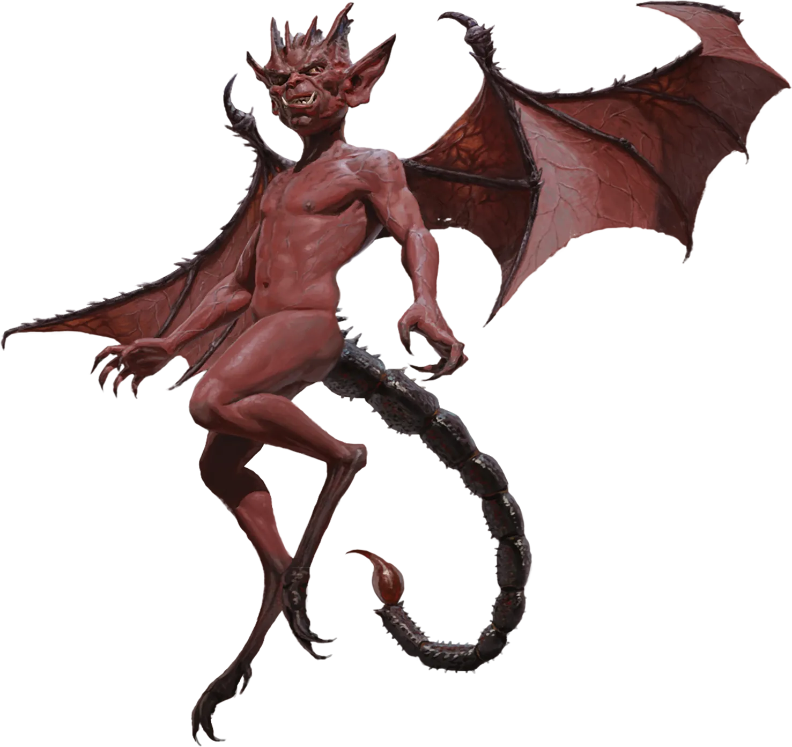
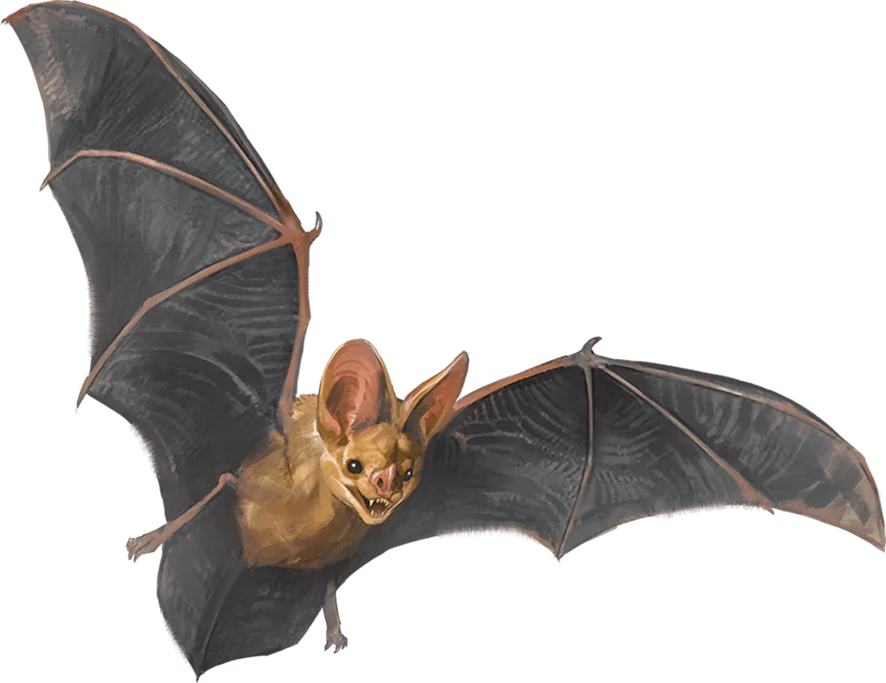
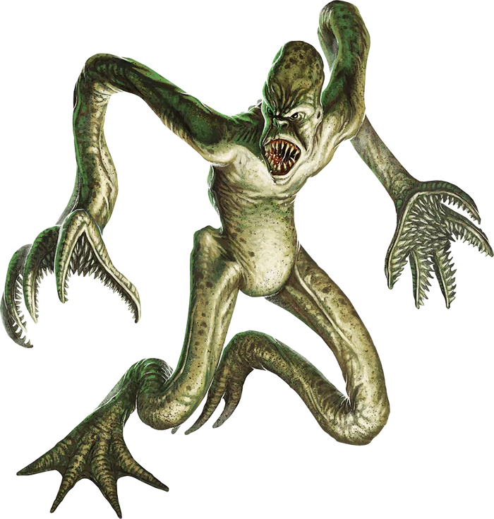
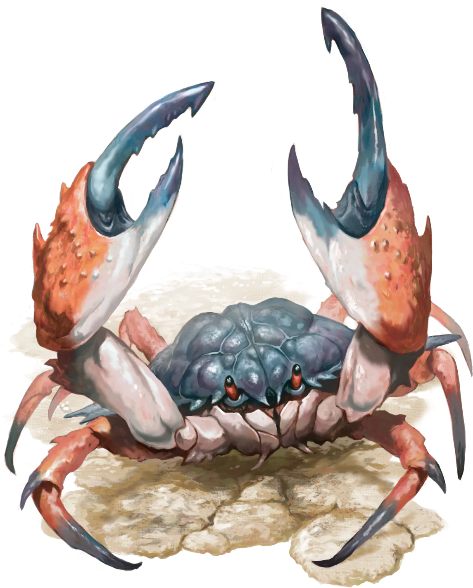
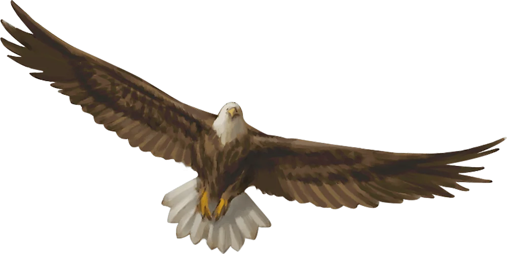
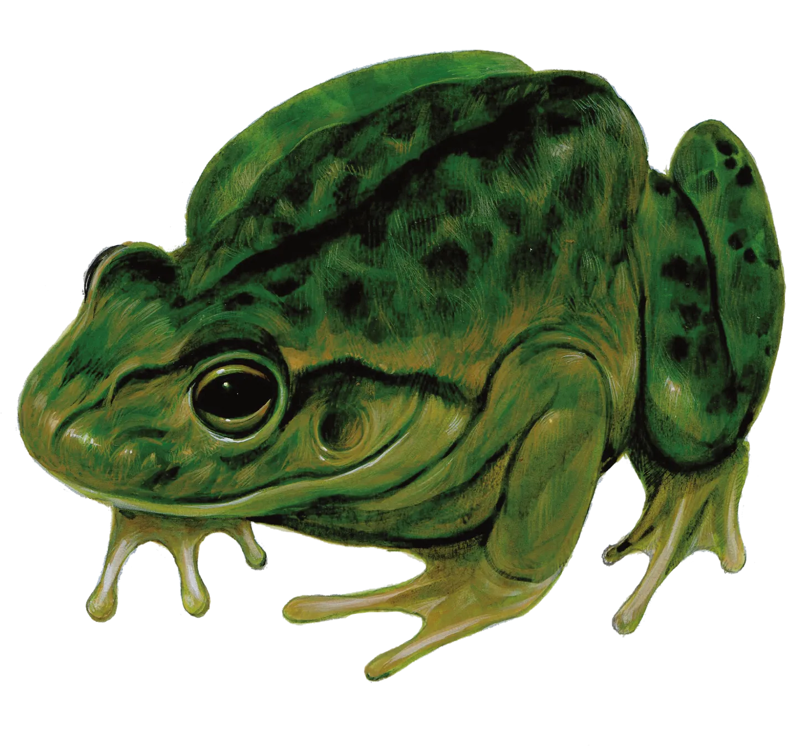

___
>Ce fichier liste des fiches de bestiaire. Les vignettes à droite de chaque entrée pointent vers les fichiers d'image situés dans `assets/enemies/` (taille réduite). Les données structurées sont disponibles dans `assets/bestiary-sublist-data.json`.
___

>## Imp
> 
>*Tiny Fiend (Devil), lawful evil*
>___
>
>- **Armor Class** 13
>- **Hit Points** 21 (6d4 + 6)
>- **Speed** 20 ft., Fly 40 ft.
>- **Initiative** +3 (13)
>___
>|STR|DEX|CON|INT|WIS|CHA|
>|:---:|:---:|:---:|:---:|:---:|:---:|
>|6 (-2)|17 (+3)|13 (+1)|11 (+0)|12 (+1)|14 (+2)|
>___
>- **Skills** Deception +4, Insight +3, Stealth +5
>- **Damage Resistances** cold
>- **Damage Immunities** fire, poison
>- **Condition Immunities** poisoned
>- **Senses** Darkvision 120 ft. (unimpeded by magical Darkness), passive Perception 11
>- **Languages** Common, Infernal
>- **Challenge** 1 (XP 200; PB +2)
>- **Proficiency Bonus** +2
>___
>***Magic Resistance.*** The imp has Advantage on saving throws against spells and other magical effects.  
>
>### Actions
>***Invisibility.*** The imp casts *Invisibility* on itself, requiring no spell components and using Charisma as the spellcasting ability.  
>
>***Sting.*** *Melee Attack Roll:*  +5, reach 5 ft. *Hit:* 6 (1d6 + 3) Piercing damage plus 7 (2d6) Poison damage.  
>
>***Shape-Shift.*** The imp shape-shifts to resemble a rat (Speed 20 ft.), a raven (20 ft., Fly 60 ft.), or a spider (20 ft., Climb 20 ft.), or it returns to its true form. Its statistics are the same in each form, except for its Speed. Any equipment it is wearing or carrying isn't transformed.

---

___
>## Bat
> 
>*Tiny Beast, unaligned*
>___
>
>- **Armor Class** 12
>- **Hit Points** 1 (1d4 - 1)
>- **Speed** 5 ft., Fly 30 ft.
>- **Initiative** +2 (12)
>___
>|STR|DEX|CON|INT|WIS|CHA|
>|:---:|:---:|:---:|:---:|:---:|:---:|
>|2 (-4)|15 (+2)|8 (-1)|2 (-4)|12 (+1)|4 (-3)|
>___
>- **Senses** Blindsight 60 ft., passive Perception 11
>- **Languages** —
>- **Challenge** 0 (XP 10; PB +2)
>- **Proficiency Bonus** +2
>___
>### Actions
>***Bite.*** *Melee Attack Roll:*  +4 to hit, reach 5 ft. *Hit:* 1 Piercing damage.

---

___
>## Choker
> 
>*Small Aberration, Typically chaotic evil*
>___
>
>- **Armor Class** 16 (natural armor)
>- **Hit Points** 13 (3d6 + 3)
>- **Speed** 30 ft.
>- **Initiative** +2 (12)
>___
>|STR|DEX|CON|INT|WIS|CHA|
>|:---:|:---:|:---:|:---:|:---:|:---:|
>|16 (+3)|14 (+2)|13 (+1)|4 (-3)|12 (+1)|7 (-2)|
>___
>- **Skills** Stealth +6
>- **Senses** Darkvision 60 ft., passive Perception 11
>- **Languages** Deep Speech
>- **Challenge** 1 (XP 200; PB +2)
>- **Proficiency Bonus** +2
>___
>***Aberrant Quickness (Recharges after a Short or Long Rest).*** The choker can take an extra action on its turn.  
>
>***Boneless.*** The choker can move through and occupy a space as narrow as 4 inches wide without squeezing.  
>
>***Spider Climb.*** The choker can climb difficult surfaces, including upside down on ceilings, without needing to make an ability check.  
>
>### Actions
>***Multiattack.*** The choker makes two Tentacle attacks.  
>
>***Tentacle.*** *Melee Weapon Attack:*  +5 to hit, reach 10 ft., one target. *Hit:* 5 (1d4 + 3) piercing damage. If the target is a Large or smaller creature, it is grappled (escape DC 15). Until this grapple ends, the target is restrained, and the choker can't use this tentacle on another target. The choker has two tentacles. If this attack is a critical hit, the target also can't breathe or speak until the grapple ends.

---

___
>## Crab
> 
>*Tiny Beast, unaligned*
>___
>
>- **Armor Class** 11
>- **Hit Points** 3 (1d4 + 1)
>- **Speed** 20 ft., Swim 20 ft.
>- **Initiative** +0 (10)
>___
>|STR|DEX|CON|INT|WIS|CHA|
>|:---:|:---:|:---:|:---:|:---:|:---:|
>|6 (-2)|11 (+0)|12 (+1)|1 (-5)|8 (-1)|2 (-4)|
>___
>- **Skills** Stealth +2
>- **Senses** Blindsight 30 ft., passive Perception 9
>- **Languages** —
>- **Challenge** 0 (XP 10; PB +2)
>- **Proficiency Bonus** +2
>___
>***Amphibious.*** The crab can breathe air and water.  
>
>### Actions
>***Claw.*** *Melee Attack Roll:*  +2, reach 5 ft. *Hit:* 1 Bludgeoning damage.

---

___
>## Eagle
> 
>*Small Beast, unaligned*
>___
>
>- **Armor Class** 12
>- **Hit Points** 4 (1d6 + 1)
>- **Speed** 10 ft., Fly 60 ft.
>- **Initiative** +2 (12)
>___
>|STR|DEX|CON|INT|WIS|CHA|
>|:---:|:---:|:---:|:---:|:---:|:---:|
>|6 (-2)|15 (+2)|12 (+1)|2 (-4)|14 (+2)|7 (-2)|
>___
>- **Skills** Perception +6
>- **Senses** passive Perception 16
>- **Languages** —
>- **Challenge** 0 (XP 10; PB +2)
>- **Proficiency Bonus** +2
>___
>### Actions
>***Talons.*** *Melee Attack Roll:*  +4, reach 5 feet. *Hit:* 4 (1d4 + 2) Slashing damage.

---

___
>## Frog
> 
>*Tiny Beast, unaligned*
>___
>
>- **Armor Class** 11
>- **Hit Points** 1 (1d4 - 1)
>- **Speed** 20 ft., Swim 20 ft.
>- **Initiative** +1 (11)
>___
>|STR|DEX|CON|INT|WIS|CHA|
>|:---:|:---:|:---:|:---:|:---:|:---:|
>|1 (-5)|13 (+1)|8 (-1)|1 (-5)|8 (-1)|3 (-4)|
>___
>- **Skills** Perception +1, Stealth +3
>- **Senses** Darkvision 30 ft., passive Perception 11
>- **Languages** —
>- **Challenge** 0 (XP 10; PB +2)
>- **Proficiency Bonus** +2
>___
>***Amphibious.*** The frog can breathe air and water.  
>
>***Standing Leap.*** The frog's Long Jump is up to 10 feet and its High Jump is up to 5 feet with or without a running start.  
>
>### Actions
>***Bite.*** *Melee Attack Roll:*  +3, reach 5 ft. *Hit:* 1 Piercing damage.

---

___
>## Frost Druid
> 
>*Medium Humanoid (Human), any alignment*
>___
>
>- **Armor Class** 13 (*hide armor*)
>- **Hit Points** 67 (9d8 + 27)
>- **Speed** 40 ft. (wolf form only), Burrow 5 ft. (fox form only), Climb 30 ft. (goat form only), Fly 60 ft. (owl form only)
>- **Initiative** +1 (11)
>___
>|STR|DEX|CON|INT|WIS|CHA|
>|:---:|:---:|:---:|:---:|:---:|:---:|
>|12 (+1)|13 (+1)|16 (+3)|10 (+0)|16 (+3)|9 (-1)|
>___
>- **Saving Throws** Int +3, Wis +6
>- **Skills** Nature +3, Perception +6, Survival +6
>- **Damage Resistances** cold
>- **Senses** Darkvision 60 ft. (beast form only), passive Perception 16
>- **Languages** Common, Druidic
>- **Challenge** 5 (XP 1 800; PB +3)
>- **Proficiency Bonus** +3
>___
>***Spellcasting (Humanoid Form Only).*** The druid is a 9th-level spellcaster. Its spellcasting ability is Wisdom (spell save DC 14; +6 to hit with spell attacks). It has the following druid spells prepared:  
>
>Cantrips (at will): *druidcraft*, *guidance*, *resistance*  
>1st level (4 slots): *animal friendship*, *fog cloud*, *speak with animals*  
>2nd level (3 slots): *animal messenger*, *moonbeam*, *pass without trace*  
>3rd level (3 slots): *conjure animals*, *sleet storm*, *wind wall*  
>4th level (3 slots): *hallucinatory terrain*, *ice storm*  
>5th level (1 slot): *awaken*  
>
>### Actions
>***Multiattack.*** The druid makes two melee attacks.  
>
>***Ice Sickle (Humanoid Form Only).*** *Melee Weapon Attack:*  +4 to hit, reach 5 ft., one target. *Hit:* 3 (1d4 + 1) slashing damage plus 5 (2d4) cold damage.  
>
>***Maul (Beast Form Only).*** *Melee Weapon Attack:*  +4 to hit, reach 5 ft., one target. *Hit:* 3 (1d4 + 1) piercing damage.  
>
>***Change Shape.*** The druid magically polymorphs into a beast form—fox, mountain goat, owl, or wolf—or back into its humanoid form. Any equipment it is wearing or carrying is absorbed or borne by the beast form (the druid's choice). It reverts to its humanoid form when it dies. The druid's statistics are the same in each form, except where noted in this stat block.

---

___
>## Ghost Dragon
> 
>*Huge Undead, any alignment*
>___
>
>- **Armor Class** 10
>- **Hit Points** 324 (24d12 + 168)
>- **Speed** 40 ft., Fly 80 ft. (hover)
>- **Initiative** +0 (10)
>___
>|STR|DEX|CON|INT|WIS|CHA|
>|:---:|:---:|:---:|:---:|:---:|:---:|
>|20 (+5)|10 (+0)|25 (+7)|16 (+3)|15 (+2)|19 (+4)|
>___
>- **Saving Throws** Con +13, Wis +8, Cha +10
>- **Skills** Perception +14, Stealth +12
>- **Damage Resistances** bludgeoning, piercing, slashing
>- **Damage Immunities** acid, cold, necrotic, poison
>- **Condition Immunities** charmed, exhaustion, frightened, grappled, paralyzed, petrified, poisoned, prone, restrained
>- **Senses** Blindsight 60 ft., Darkvision 120 ft., passive Perception 24
>- **Languages** Common, Draconic, telepathy 120 ft.
>- **Challenge** 17 (XP 18 000; PB +6)
>- **Proficiency Bonus** +6
>___
>***Incorporeal Movement.*** The ghost dragon can move through other creatures and objects as if they were difficult terrain. It takes 5 (1d10) force damage if it ends its turn inside an object.  
>
>***Legendary Resistance (3/Day).*** If the ghost dragon fails a saving throw, it can choose to succeed instead.  
>
>***Unusual Nature.*** The ghost dragon doesn't require air, food, drink, or sleep.  
>
>### Actions
>***Multiattack.*** The ghost dragon makes one Bite attack and two Claw attacks.  
>
>***Bite.*** *Melee Weapon Attack:*  +11 to hit, reach 10 ft., one target. *Hit:* 32 (6d8 + 5) cold damage, and the target's speed is halved until the start of the dragon's next turn.  
>
>***Claw.*** *Melee Weapon Attack:*  +11 to hit, reach 5 ft., one target. *Hit:* 14 (2d8 + 5) necrotic damage.  
>
>***Terrifying Breath (Recharge 6).*** The ghost dragon exhales shadowy mist in a 90-foot cone. Each creature in that area must make a DC 21 Constitution saving throw. On a failed save, the creature takes 40 (9d8) cold damage and is frightened of the ghost dragon for 1 minute. On a successful save, the creature takes half as much damage and isn't frightened.  
>While frightened of the ghost dragon, a creature is paralyzed. The frightened creature can repeat the saving throw at the end of each of its turns, ending the effect on itself on a success.  
>If a creature's saving throw is successful or the effect ends for it, the creature is immune to this ghost dragon's Terrifying Breath for the next 24 hours.

---

___
>## Hobgoblin Warrior
> 
>*Medium Fey (Goblinoid), lawful evil*
>___
>
>- **Armor Class** 18
>- **Hit Points** 11 (2d8 + 2)
>- **Speed** 30 ft.
>- **Initiative** +3 (13)
>___
>|STR|DEX|CON|INT|WIS|CHA|
>|:---:|:---:|:---:|:---:|:---:|:---:|
>|13 (+1)|12 (+1)|12 (+1)|10 (+0)|10 (+0)|9 (-1)|
>___
>- **Senses** Darkvision 60 ft., passive Perception 10
>- **Languages** Common, Goblin
>- **Challenge** 1/2 (XP 100; PB +2)
>- **Proficiency Bonus** +2
>___
>***Pack Tactics.*** The hobgoblin has Advantage on an attack roll against a creature if at least one of the hobgoblin's allies is within 5 feet of the creature and the ally doesn't have the Incapacitated condition.  
>
>### Actions
>***Longsword.*** *Melee Attack Roll:*  +3, reach 5 ft. *Hit:* 12 (2d10 + 1) Slashing damage.  
>
>***Longbow.*** *Ranged Attack Roll:*  +3, range 150/600 ft. *Hit:* 5 (1d8 + 1) Piercing damage plus 7 (3d4) Poison damage.

---

___
>## Ice Troll
> 
>*Large Giant, chaotic evil*
>___
>
>- **Armor Class** 16 (natural armor)
>- **Hit Points** 115 (10d10 + 60)
>- **Speed** 30 ft.
>- **Initiative** -1 (9)
>___
>|STR|DEX|CON|INT|WIS|CHA|
>|:---:|:---:|:---:|:---:|:---:|:---:|
>|18 (+4)|8 (-1)|22 (+6)|7 (-2)|9 (-1)|7 (-2)|
>___
>- **Skills** Perception +2
>- **Damage Immunities** cold
>- **Senses** Darkvision 60 ft., passive Perception 12
>- **Languages** Giant
>- **Challenge** 8 (XP 3 900; PB +3)
>- **Proficiency Bonus** +3
>___
>***Cold Aura.*** While it's alive, the troll generates an aura of bitter cold that fills the area within 10 feet of it. At the start of the troll's turn, all nonmagical flames in the aura are extinguished. Any creature that starts its turn within 10 feet of the troll takes 10 (3d6) cold damage.  
>
>***Keen Smell.*** The ice troll has advantage on Wisdom (Perception) checks that rely on smell.  
>
>***Regeneration.*** The ice troll regains 10 hit points at the start of its turn. If the troll takes acid or fire damage, this trait doesn't function at the start of the troll's next turn. The ice troll dies only if it starts its turn with 0 hit points and doesn't regenerate.  
>
>### Actions
>***Multiattack.*** The troll makes three attacks: one with its bite and two with its claws.  
>
>***Bite.*** *Melee Weapon Attack:*  +7 to hit, reach 5 ft., one target. *Hit:* 7 (1d6 + 4) piercing damage plus 9 (2d8) cold damage.  
>
>***Claw.*** *Melee Weapon Attack:*  +7 to hit, reach 5 ft., one target. *Hit:* 11 (2d6 + 4) slashing damage plus 9 (2d8) cold damage. If the target takes any of the cold damage, the target must succeed on a DC 15 Constitution saving throw or have disadvantage on its attack rolls until the end of its next turn.