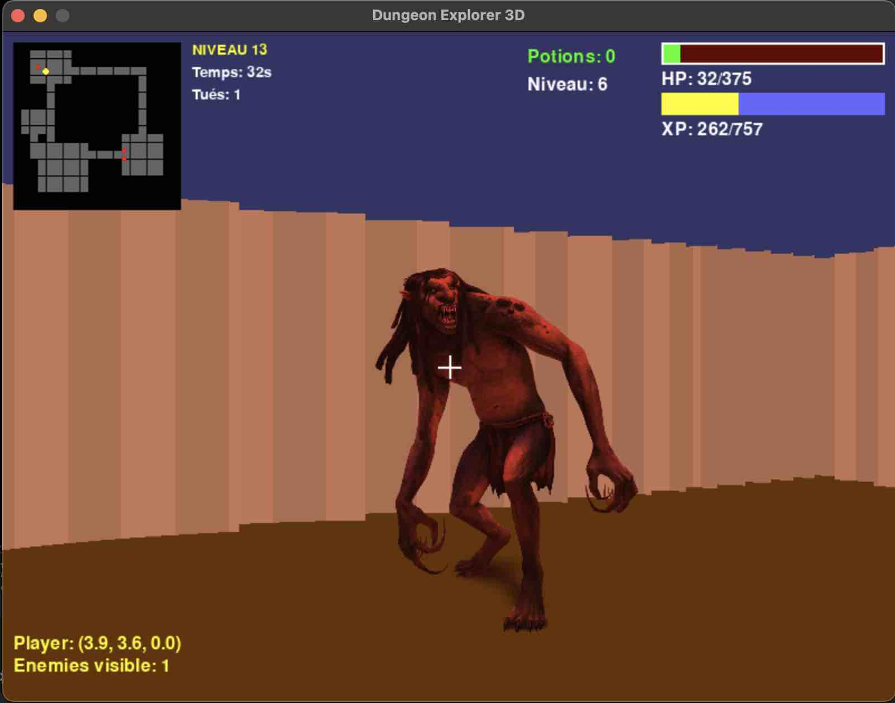
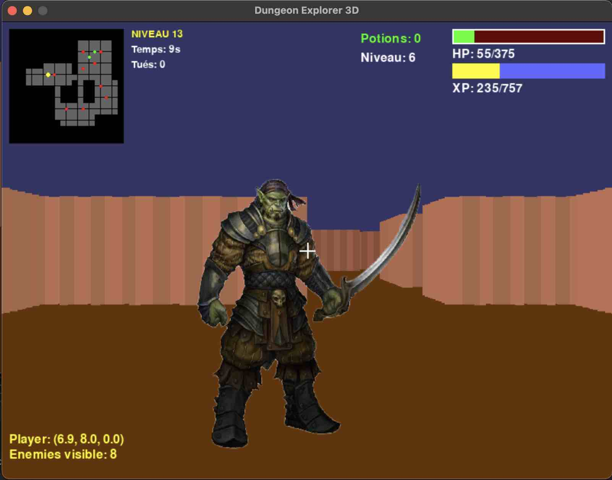
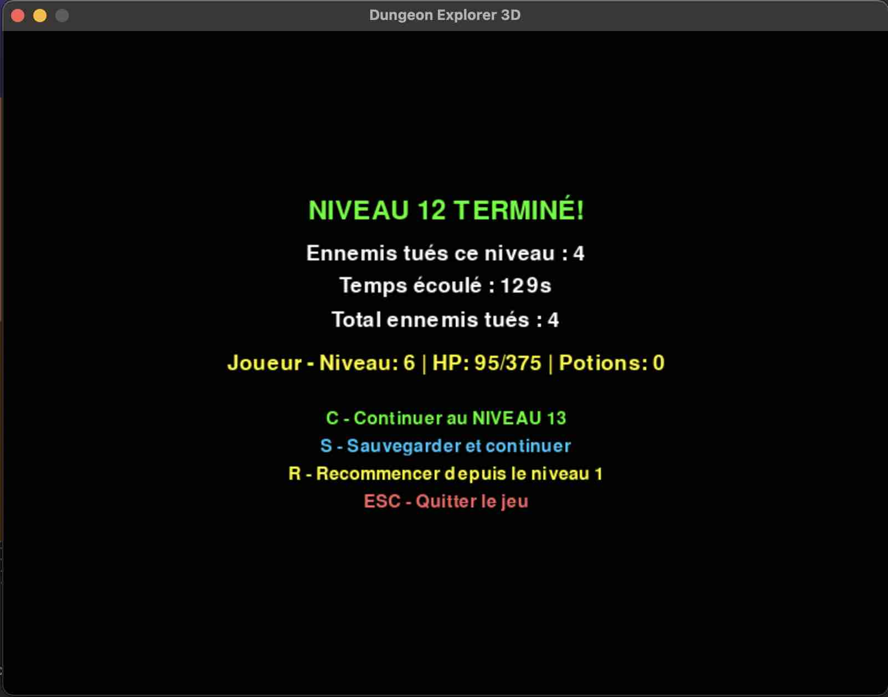

# Captures d'écran du jeu

- `assets/screenshots/start_game.jpg` — Écran de début du jeu : résumé des contrôles, chargement de partie sauvegardée
- `assets/screenshots/exploration.jpg` — Écran d'exploration : mini-carte, joueur et ennemis, barre de vie et barre d'XP sous la vie.
- `assets/screenshots/combat.jpg` — Écran de combat : vue rapprochée de l'ennemi, HP et XP du joueur et de l'ennemi, boutons d'action.
- `assets/screenshots/level_complete.jpg` — Écran de fin de niveau : résumé des statistiques, options pour lancer le niveau suivant ou sauvegarder.

---
